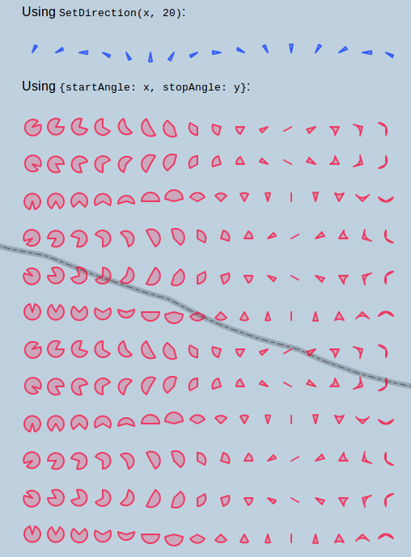
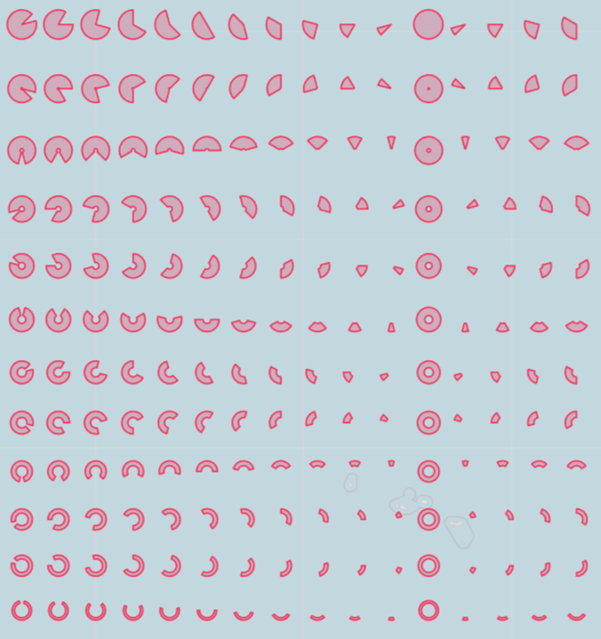

Leaflet-Semicircle.
-------------------

Allows drawing semicircles on leaflet maps.

It's an extension of Leaflet's [`L.Circle`](http://leafletjs.com/reference-1.1.0.html#circle),
and behaves like `L.Circle` if the a semicircle of almost 360 degrees is displayed.

Updated for use with leaflet 1.1.0.

## Provided classes: ##
<table>
<tr>
    <td>
        <code>L.SemiCircle</code>/
        <code>L.SemiCircleMarker</code><br />
        factories: <code>L.semiCircle</code>/<code>L.SemiCircleMarker</code>
    </td>
    <td>
        Options:<br />
        <code>startAngle</code>: start angle of the semicircle <br />
        <code>stopAngle</code>: stop angle of the semicircle<br />
        Angles are defined like compass courses: 0 = north, 90 = east, etc.
        <br />
        <code>innerRadius</code>: defines an inner radius to display a ring instead of a circle <br />
        <code>ringWidth</code>: set thickness of the ring, if set it overwrites the <code>innerRadius</code><br />
    </td>
</tr>

## Provided methods: ##
<table>
<tr>
    <td><code>L.SemiCircle.setStartAngle(angle)</code></td>
    <td>Set the start angle of the circle to <code>angle</code> and redraw.</td>
</tr>
<tr>
    <td><code>L.Circle.setStopAngle(angle)</code></td>
    <td>Set the stop angle of the circle to <code>angle</code> and redraw.</td>
</tr>
<tr>
    <td><code>L.Circle.setDirection(direction, size)</code></td>
    <td>Set the <code>startAngle</code> to <code>direction - (0.5 * size)</code> and the <code>stopAngle</code> to <code>direction + (0.5 * size)</code> and redraw.</td>
</tr>
</table>

## Usage:
The plugin provides two ways to only display a part of the circle:
1. Use the `options` map and set `startAngle` and `stopAngle`.
3. Use the `options` the option `innerRadius` or `ringWidth` to draw a ring instead of a circle. 
2. Use `setDirection(direction, size)` to display a semicircle of `size` degrees at `direction`.


## Example:
[Live demo](http://jieter.github.io/Leaflet-semicircle/examples/semicircle.html)

Using `options.startAngle` and `options.stopAngle`:
```js
L.semiCircle([51.5, -0.09], {
    radius: 500,
	startAngle: 45,
	stopAngle: 135
}).addTo(map);
```

Draw the same semicircle using `setDirection(direction, size)`:
```js
L.semiCircle([51.5, -0.09], {radius: 500})
	.setDirection(90, 90)
	.addTo(map);
```

Draw the same semicircle using as a ring:
```js
L.semiCircle([51.5, -0.09], {
    radius: 500,
    innerRadius: 300,
    //// same as:
    // ringWidth: 200,
	startAngle: 45,
	stopAngle: 135
}).addTo(map);
```

## Screenshot:

[Live demo](http://jieter.github.io/Leaflet-semicircle/examples/semicircle.html)



### Screenshot Using Rings
[Live demo](http://jieter.github.io/Leaflet-semicircle/examples/semirings.html)



## Changelog

### 2.0.2 (2017-09-01)
 - Fixed #24: instance check for canvas renderer

### 2.0.1 (2017-07-22)
 - Fixed #14: Poleward displacement of circle center when radius is large.

### 2.0.0 (2017-07-09)
 - Changed the API to stand-alone classes rather than overwriting `L.Circle` with an extension of itself.
 - Added support for Leaflet 1.1.0
