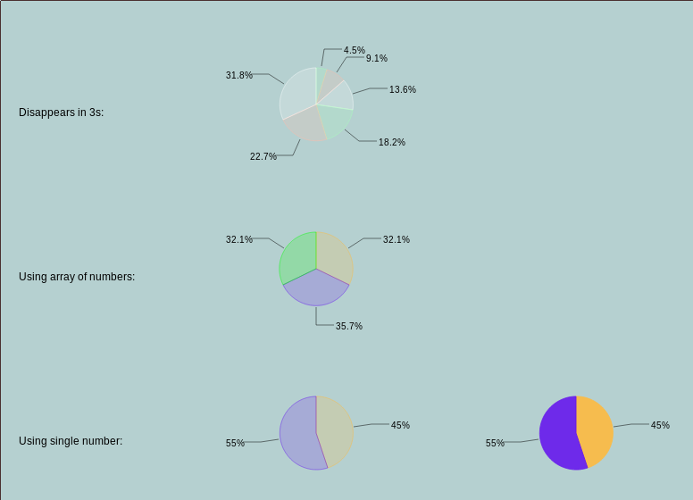

Pie charts in Leaflet-Semicircle
--------------------------------

Uses Semicircle to display pie charts on a map.

## Usage
Apart from the latlng and options param, the key here is the `data` parameter. It can be one of the following:

```js
// Just one number: treated as a percantage (0...100) 
// -> creates two chunks: 45% and 55%
L.pie([50.66, 0.05], 45).addTo(map);

// An array of numbers, sum is scaled to occupy 360 degrees
// -> creates three 33.33..% chunks.
L.pie([50.66, 0.05], [1, 1, 1]).addTo(map);

// An array of objects, for which the label can also be defined.
// -> creates three chunks with text labels.
L.pie([50.68, 0.05], [
	{num: 45, label: 'Bob'},
	{num: 60, label: 'Tom'},
	{num: 45, label: 'Ada'}
]).addTo(map);
```

## Screenshot:

